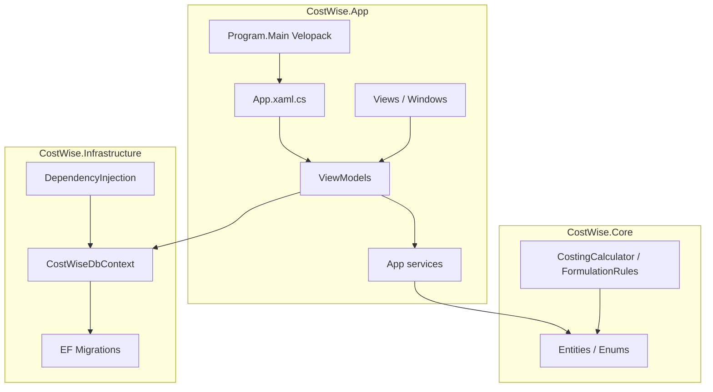
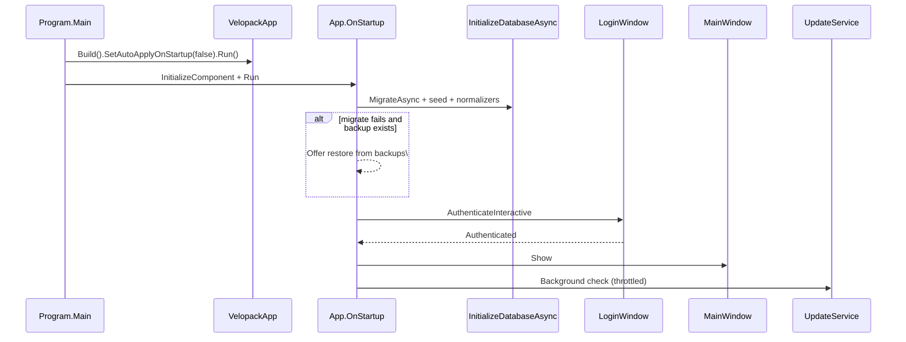

# Architecture

OBAID Pricing is a **.NET 8 WPF** desktop app (assembly / exe name `ObaidPricing`) for fish-feed formulations, costing, and pricing. The solution nickname in source is **CostWise**.

## Layers

| Project | Role |
|---------|------|
| **CostWise.App** | WPF UI, MVVM, auth, updates, PDF/Excel export, DI host |
| **CostWise.Core** | Domain entities, enums, pure costing/import rules |
| **CostWise.Infrastructure** | EF Core SQLite, migrations, seeders, normalizers, CLI DB args |
| **tests/** | xUnit (Core costing/import; App auth/update prefs) |
| **tools/** | Optional CLI importers (explicit `--db` or `--force-local`) |

## Startup sequence

Key files:

- [`src/CostWise.App/Program.cs`](../src/CostWise.App/Program.cs) — Velopack hooks before WPF
- [`src/CostWise.App/App.xaml.cs`](../src/CostWise.App/App.xaml.cs) — host, DI, DB init, login, update schedule
- [`src/CostWise.Infrastructure/DependencyInjection.cs`](../src/CostWise.Infrastructure/DependencyInjection.cs) — SQLite path + `MigrateAsync`

## UI pattern

- **MVVM** with CommunityToolkit.Mvvm (`ObservableObject`, `[RelayCommand]`)
- **Navigation:** `INavigationService` / `MainViewModel` sidebar keys (`formulations`, `nutrition`, `compare`, …)
- **ViewLocator** maps ViewModel type → View `UserControl`
- **Auth gate:** `LoginWindow` before main shell; `ShutdownMode.OnExplicitShutdown` so closing login does not kill the process prematurely

## Data and install separation

| Concern | Location |
|---------|----------|
| App binaries (Velopack) | `%LocalAppData%\ObaidPricing\` |
| User DB / prefs / auth / logs | `%LocalAppData%\CostWise\` |

Updates replace binaries only; schema evolves via EF migrations on next launch. See [update-process.md](update-process.md) and [database-schema.md](database-schema.md).

## Cross-cutting services (App)

| Service | Purpose |
|---------|---------|
| `AppPreferences` | Decimals, nav order, update policy (JSON) |
| `AuthAccountStore` / `AuthSession` | Local login (DPAPI) |
| `UpdateService` | Velopack + GitHub Releases |
| `DatabaseBackupService` | Pre-update SQLite snapshots |
| `AppLog` | File logs under `CostWise\logs` |
| `ProductionExportService` | Matrix / PDF / Excel exports |

## Security notes (product)

- Login gates the UI; **SQLite is not encrypted at rest** (file copy bypasses login).
- Password/PIN stored as salted hashes in DPAPI-protected `user-account.dat`.
- Lockout: 5 failed attempts → short cooldown.
