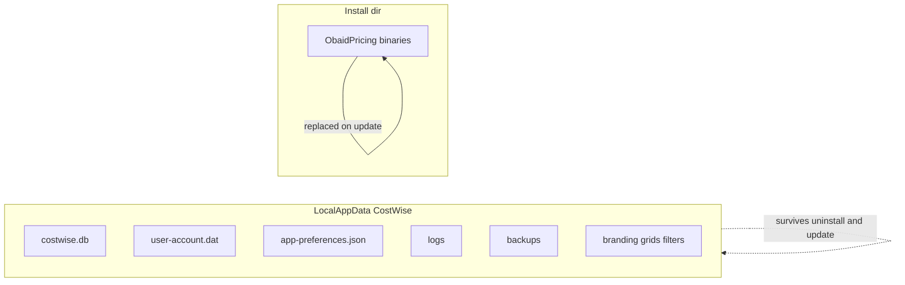

# Backup and restore

There is **no in-app Backup/Restore wizard**. Operators copy folders (and rely on automatic pre-update DB snapshots).

## What to back up

Copy the entire user folder:

`%LocalAppData%\CostWise\`



| Item | Required for full restore? |
|------|----------------------------|
| `costwise.db` | Yes — all formulations/pricing data |
| `user-account.dat` | Yes — login (machine-bound DPAPI) |
| `app-preferences.json` | Recommended |
| `branding\` | If custom logos |
| Grid/filter/compare JSON | Optional UI state |
| `backups\` | Prior DB snapshots |
| `logs\` | Diagnostics only |

**Note:** `user-account.dat` is protected with Windows DPAPI for the current user. Restoring to another Windows user/machine may require recreating the login (first-run setup) even if the DB restores.

## Manual backup

```powershell
$src = "$env:LOCALAPPDATA\CostWise"
$dst = "D:\Backups\CostWise-$(Get-Date -Format yyyyMMdd-HHmmss)"
Copy-Item -Path $src -Destination $dst -Recurse
```

Stop the app first so SQLite is not mid-write.

## Manual restore

1. Close OBAID Pricing.
2. Optionally rename the current folder to `CostWise.__old__`.
3. Copy the backup folder to `%LocalAppData%\CostWise\`.
4. Start the app (migrations run if the restored DB is older than the app).

## Automatic pre-update snapshots

Before Velopack applies an update, the app copies:

`%LocalAppData%\CostWise\backups\pre-update-{version}-{timestamp}.db`

(keeps the latest 5). If schema migration fails after an update, the app can offer restore of the latest snapshot.

To restore only the DB manually:

```powershell
Copy-Item "$env:LOCALAPPDATA\CostWise\backups\pre-update-....db" `
          "$env:LOCALAPPDATA\CostWise\costwise.db" -Force
```

## Uninstall behavior

| Action | Binaries | `%LocalAppData%\CostWise\` |
|--------|----------|----------------------------|
| Velopack / Inno uninstall | Removed | **Kept** |
| Reinstall same or newer app | Fresh binaries | Existing data reused |

See [update-process.md](update-process.md) and [deployment-guide.md](deployment-guide.md).
