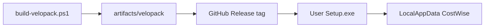

# Deployment guide

## Target environment

- Windows 10 / 11 **x64**
- No separate .NET Desktop Runtime required (self-contained publish)
- Network access to **GitHub** for auto-updates (unless updates disabled or offline)

## Recommended path (Velopack + GitHub)



1. Bump version (see [build-process.md](build-process.md)).
2. Run `installer\build-velopack.ps1` (optional signing via `OBAD_SIGN_*`).
3. Create a GitHub Release on [`vulf-lab/obaid-price`](https://github.com/vulf-lab/obaid-price) (e.g. tag `v1.0.1`).
4. Upload **all** files from `artifacts/velopack/` without renaming.
5. Publish the release (non-prerelease for production).
6. Users install `ObaidPricing-win-Setup.exe` from that release (or an internal mirror of the same assets).

First run: create password → DB initializes under `%LocalAppData%\CostWise\`.

## Offline / air-gapped

- Distribute Setup.exe (+ optional full nupkg set) via USB/share.
- Set Settings → Updates → **Do not check for updates**, or leave Prompt and ignore dialogs.
- Schema still upgrades from packaged migrations when a newer Setup is installed manually.

## Legacy Inno deployment

Use only when a machine-wide Program Files install is required. Build with `build-installer.ps1`, distribute `ObaidPricing-Setup-*.exe`. Users will **not** get in-app GitHub updates until they switch to Velopack.

## Validation before wide rollout

```powershell
powershell -File installer\validate-velopack.ps1
# Optional legacy clean-install simulation:
powershell -File installer\validate-release.ps1 -SkipBuild
```

Then complete [release-checklist.md](release-checklist.md).

## Known deployment caveats

| Issue | Mitigation |
|-------|------------|
| Unsigned Setup → SmartScreen | Sign with `OBAD_SIGN_CERT` or instruct users to allow publisher |
| SQLite unencrypted at rest | Restrict OS account access; backup policy |
| DPAPI login file | Account is per-Windows-user |
| Large self-contained payload | Expect large Setup / packages |

## Post-deploy support pointers

- Logs: `%LocalAppData%\CostWise\logs\`
- Data backup: [backup-and-restore.md](backup-and-restore.md)
- Update failures: [troubleshooting.md](troubleshooting.md)
